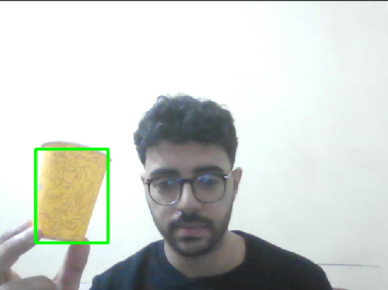

# 🟨 Real-Time Yellow Color Detection Using OpenCV

This project detects **yellow-colored objects** in real-time using your webcam. It processes frames with OpenCV, detects yellow hues in HSV color space, and highlights them using a green bounding box.



---

## 🛠️ Tech Stack

- **Python**
- **OpenCV** - for video capture and color processing
- **NumPy** - for numerical operations
- **Pillow (PIL)** - to work with image bounding boxes

---

## 🧠 How It Works

1. Captures frames from your webcam (`cv2.VideoCapture`).
2. Converts frames from BGR to HSV color space.
3. Applies a mask to isolate yellow pixels using dynamic thresholds.
4. Calculates a bounding box around the detected yellow area using Pillow.
5. Draws a green rectangle around the detected object in the video stream.

---

## 📁 File Structure

```plaintext
.
├── main.py          # Main script that captures webcam input and detects yellow objects
├── util.py          # Helper module to compute HSV limits for a given BGR color
├── screenshot.png   # Screenshot of detection in action
└── README.md        # This file
